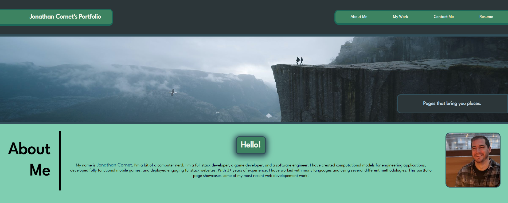
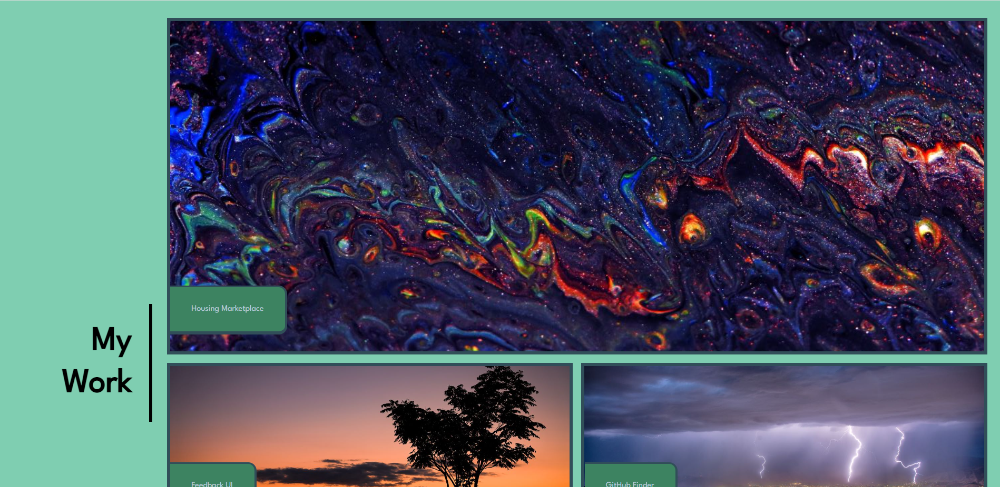
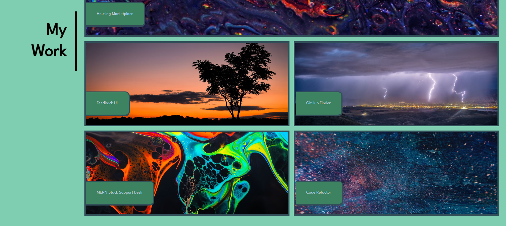
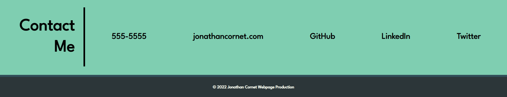

# Code Refactor Challenge

## Description

This challenge involves creating a portfolio page which showcases previous work and tells the user about yourself. The webpage is interactive and responsive, and the following Acceptance Criteria is met:

```
GIVEN I need to sample a potential employee's previous work
WHEN I load their portfolio
THEN I am presented with the developer's name, a recent photo or avatar, and links to sections about them, their work, and how to contact them
WHEN I click one of the links in the navigation
THEN the UI scrolls to the corresponding section
WHEN I click on the link to the section about their work
THEN the UI scrolls to a section with titled images of the developer's applications
WHEN I am presented with the developer's first application
THEN that application's image should be larger in size than the others
WHEN I click on the images of the applications
THEN I am taken to that deployed application
WHEN I resize the page or view the site on various screens and devices
THEN I am presented with a responsive layout that adapts to my viewport
```

The webpage looks as following:






## Installation

No Installation is needed to view and use this webpage.

## Usage

In order to access the refactored website, visit:

https://cornetj13.github.io/portfolio-page/

## Credits

This project was designed by the UW fullstack bootcamp and was fully implemented by me. I used the YouTube channels below to implement some CSS tricks:

https://www.youtube.com/kepowob

## License

Please refer to the LICENSE in the repo.
